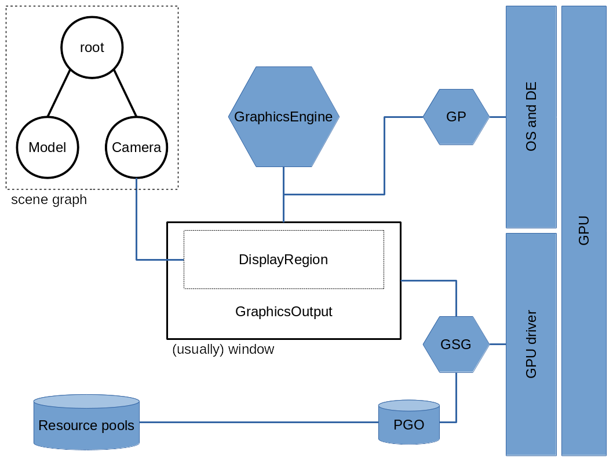

Again, `ShowBase` does A LOT. Let's consider the bits between scene
graph on one side, and the graphics APIs on the other:

[Here is a program](./internals.py) that sets it all up
without resorting to `ShowBase`.

### `render_frame` in detail

Rendering is a three step process:
* App
* Cull
* Draw

These steps can all be run sequentially (non-threaded), or distributed
onto two or three threads. While the end-to-end time for each frame is
still the same, doing so may increase the rate at which frames are
finished (if the total time that each frame takes to process exceeds the
frame budget). Part of `render_frame` is to wait for all thread to be
done with their current workload, and then to start the next batch. How
the three stages are combined into threads is the threading model.

`render_frame` does:
* Flush BamCache (because why *not* here?)
* `open_windows()`: Just that.
* Flip frames (if flipping on sync)
* Release RAM images of textures that were drawn in the previous frame
* `_app.do_frame()`: The actual work of the three stages.
  * engine->cull_to_bins(_cull): Culls (if the threading model separates
    Cull and Draw).
  * engine->cull_and_draw_together(_cdraw): Culls and draws (if the
    threading model combines them).
  * engine->draw_bins(_draw): Draws (again, if the threading model
    separates Cull and Draw).
  * engine->process_events(_window): Handles events caught by windows.
* `_pipeline.cycle()`: Pushes each thread's data onto the next one.
* `GeomVertexArrayData::lru_epoch()`: Informs all relevant LRU caches
  that evictions may be considered / performed now.
* Manage threads to wait for still-running ones, then begin next frame.
